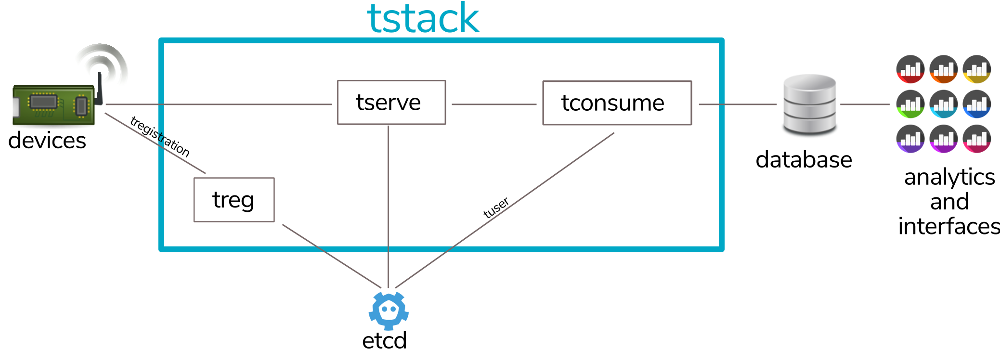

# tstack

There's a [quickstart](quickstart.md) guide to get a stack running quickly with docker.

For more detailed information, there is documentation for the various Tstack components:

* [tserve](tserve.md) - An MQTT broker
* [treg](treg.md) - RESTful registration service
* [tregister](tregister.md) - Command line tool to register standard users, using the treg service
* [tuser](tuser.md) - Command line tool to register users with greater access rights
* [tconsume](tconsume.md) - Command line MQTT consumer with a number of backends
* [tpublish](tpublish.md) - Command line MQTT message publisher

...and also:

* [Installation Guide](installation.md)
* [Frequently Asked Questions](faq.md)
* [Notes on performance tuning as well as testing](performance.md)
* [What is MQTT?](mqtt.md)

